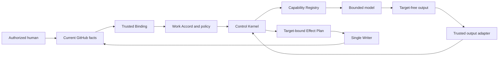

# Hyperfinite

**Unbounded capability. Finite control.**

> Hyperfinite is a GitHub-native control plane for governed, model-assisted
> work. This repository is prepared for customer-owned evaluation in GitHub
> Enterprise Cloud.

**Start here:** [Customer evaluation guide](CUSTOMER_EVALUATION_GUIDE.md) ·
[70-question customer FAQ](CUSTOMER_FAQ.md) ·
[Copy-ready approval tickets](docs/runbooks/customer-approval-tickets.md) ·
[Architecture](docs/architecture/overview.md) ·
[Security](docs/security/README.md)

## Executive summary

Organizations want the speed of model-assisted software work without making a
probabilistic model responsible for authorization, target selection,
credentials, administrative changes, or irreversible effects. Hyperfinite
separates those concerns.

Models may create bounded advisory artifacts. Deterministic code retains
authority over identity, policy, lifecycle transitions, capabilities, targets,
credentials, retries, effects, and evidence. Independent humans retain
administration, activation, approval, merge, release, and adoption decisions.

The customer evaluation is designed to answer five questions:

1. Can a customer run bounded model-assisted workflows in its own GitHub
   Enterprise Cloud environment?
2. Can every target and effect remain bound to current authenticated evidence?
3. Can missing, stale, ambiguous, or unavailable controls fail closed?
4. Can operators understand cost, evidence, recovery, and human gates?
5. Can the customer stop, recover, remove, or extend the evaluation safely?

The repository includes the deterministic Control Kernel, policy compiler,
Capability Registry, GitHub adapter boundaries, disabled-by-default Agentic
Workflow runtime, four governed demonstrations, durable local reference
adapters, simulation and adversarial tests, packaging, customer-starter
generation, Project planning, and administrator handoff evidence.

The repository intentionally stops before customer administrative effects. It
does not create Projects, install a GitHub App, hold customer credentials,
deploy trust services, enable paid inference, alter organization policy,
approve or merge pull requests, or publish artifacts. Those actions require the
customer owners and evidence listed in the
[evaluation guide](CUSTOMER_EVALUATION_GUIDE.md).

## Who this is for

| Reader | Start here | Decision or responsibility |
|---|---|---|
| Executive sponsor | This README and [FAQ](CUSTOMER_FAQ.md) | Evaluation scope, outcome, funding, and stop/go decision |
| Evaluation lead | [Evaluation guide](CUSTOMER_EVALUATION_GUIDE.md) | Coordinate owners, tickets, timeline, evidence, and feedback |
| GitHub administrator | [Customer administrator runbook](docs/runbooks/customer-administrator.md) | Repository, Projects, App, Actions, rulesets, and environments |
| Security/identity owner | [Security index](docs/security/README.md) and [App permissions](docs/security/github-app-permissions.md) | Threat model, OIDC, key custody, permissions, monitoring, and incident controls |
| Platform engineer | [Deployment prerequisites](docs/runbooks/deployment-prerequisites.md) | Trust services, stores, runner, health, backup, and recovery |
| Operator | [Portfolio operator runbook](docs/demos/portfolio/operator-runbook.md) | Validation, dry runs, canary, readback, pause, and recovery |
| Legal/privacy reviewer | [Governance](GOVERNANCE.md) and [provenance policy](docs/provenance/README.md) | License, data use, retention, feedback, and evaluation terms |
| Developer/reviewer | [Contributing](CONTRIBUTING.md) and [source map](src/README.md) | Contract-safe changes and independent exact-head review |

## Evaluation maturity

| Layer | Included state | Customer action |
|---|---|---|
| Repository contracts and hermetic demonstrations | Deterministically testable at an exact head | Independently validate the copied head |
| Customer-owned repository | Portable workflows and source-derived repository identity | Create a new private repo, initial commit, CODEOWNERS, and protections |
| GitHub Projects | Closed schemas, target-manifest generator, dry-run plan, and readback | Create four empty Projects and confirm exact target digest |
| GitHub App and OIDC | Least-privilege permission and identity contracts | Register/install the App and configure customer trust |
| Trust services and durable stores | Interfaces, topology, local reference implementation, and fault tests | Deploy isolated customer-owned services and stores |
| Agentic Workflow runtime | Compiler-owned workflows, exact bindings, staged outputs, and fail-closed guards | Configure protected variables and authorize a bounded window |
| Customer canary | Synthetic inputs, stop-at-Human-Review contract, and evidence model | Run one approved canary and evaluate the evidence |
| Broader adoption | No automatic decision | Customer governance decides scope, SLOs, support, and residual risk |

## The first 30 minutes

After copying the files into a new private customer repository:

1. Confirm the customer repository uses `main` as its default branch.
2. Confirm the `origin` remote points to the customer repository.
3. Install the supported toolchain from
   [`config/v1alpha1/compatibility.json`](config/v1alpha1/compatibility.json).
4. Install locked dependencies:

   ```bash
   npm ci --ignore-scripts --no-audit --no-fund
   ```

5. Rewrite [`.github/CODEOWNERS`](.github/CODEOWNERS) deterministically:

   ```bash
   npm run customer:configure -- \
     --codeowner @YOUR-ORG/hyperfinite-maintainers
   ```

   User-owned repositories may provide a user such as
   `--codeowner @YOUR-USER`.
6. Run:

   ```bash
   npm run validate:customer-readiness
   npm run typecheck
   npm run build
   npm test
   ```

7. Create the customer's initial import commit.
8. Rebind the customer-starter selections to that new history:

   ```bash
   npm run customer:repin
   git diff -- config/v1alpha1/customer-starter-selection.json \
     config/v1alpha1/customer-starter-demo-portfolio-selection.json
   ```

9. Confirm that only the two selection files contain the expected new source
   head and closure digests, then commit them.
10. Push `main` and run `git fetch origin main` so exact-head tooling can verify
   the remote base.
11. Review the resulting repository with the customer's security and platform
   owners.
12. Open the applicable
   [approval tickets](docs/runbooks/customer-approval-tickets.md).
13. Keep `AGENTIC_RUNTIME_ENABLED` unset or not equal to `true`.

`validate:customer-readiness` scans every tracked or newly added file for source
organization bindings, private network links, live
Project IDs, and source issue/PR history references. It complements customer secret,
dependency, code, history, privacy, and legal review.

## Customer implementation path

### 1. Establish the customer trust boundary

- Use a private customer-owned repository with a new history. Run
  `npm run customer:repin` from the clean initial import commit, review the two
  generated selection changes, and commit them before the full validation.
- Assign an executive sponsor, evaluation lead, GitHub administrator, security
  owner, platform owner, identity/key owner, billing owner, operator, and
  independent reviewer.
- Replace synthetic placeholders only in customer configuration. Keep test
  fixtures explicitly synthetic.
- Define allowed data classifications, retention, feedback, incident, support,
  budget, and shutdown policies.

### 2. Validate the exact copied head

Run the [complete validation matrix](#complete-validation-matrix). Record the
customer commit SHA and tool versions. Any later change requires fresh evidence.

### 3. Prepare four customer Projects

Have a human organization owner create four empty private Projects using the
documented titles and Board layout. Export fresh admin snapshots and generate a
target manifest:

```bash
npm run github:setup -- target-manifest \
  --catalog config/v1alpha1/demo-portfolio/catalog.json \
  --schema-root config/v1alpha1/demo-projects \
  --live path/to/fresh-admin-snapshots \
  --evaluated-at <current-RFC3339-time> \
  --output path/to/customer-project-targets.json
```

An independent human reviews every owner, repository, Project, and view
identity, then records the manifest's `contentDigest`. The bootstrap planner
requires that exact digest:

```bash
npm run github:setup -- bootstrap-plan \
  --catalog config/v1alpha1/demo-portfolio/catalog.json \
  --target-manifest path/to/customer-project-targets.json \
  --confirmed-target-manifest-digest sha256:<confirmed-digest> \
  --schema-root config/v1alpha1/demo-projects \
  --live path/to/fresh-admin-snapshots \
  --issue-bindings path/to/customer-issue-bindings.json \
  --evaluated-at <current-RFC3339-time> \
  --output path/to/reviewed-bootstrap-plan.json
```

The CLI performs no mutation. A human applies only the confirmed operations,
exports fresh readback, and follows the two manual view steps in the
[Project setup runbook](docs/runbooks/github-project-setup.md).

### 4. Register the customer-owned GitHub App

Use the exact operation-based permissions in
[GitHub App permissions](docs/security/github-app-permissions.md). Install the
App only on approved evaluation repositories. Keep its private key and
short-lived installation tokens inside the customer token broker.

PAT, ambient-token, model-job credential, wildcard installation, and
success-shaped fallback paths are unsupported.

### 5. Deploy customer trust services

Deploy separate identities for:

1. webhook verification and fresh binding resolution;
2. runtime-state publication;
3. OIDC authorization redemption and budget reservation;
4. threat, DLP, policy, and evidence signing;
5. conditional evidence and operation-grant storage;
6. operation-scoped GitHub App token brokerage;
7. Single Writer and reconciliation; and
8. the isolated verification runner and installation/release adapter.

See the [deployment prerequisite matrix](docs/runbooks/deployment-prerequisites.md)
for owners and acceptance evidence.

### 6. Configure customer controls

Configure:

- CODEOWNERS and an independent-review ruleset;
- required checks and current-head approval;
- selected and SHA-pinned Actions;
- protected environments and runtime variables;
- GHAS, CodeQL, Dependency Review, Dependabot, and secret scanning according to
  customer policy;
- model entitlement, budget ceilings, alerts, and shutdown owner;
- logging, evidence, backup, and retention;
- monitoring and incident routing; and
- key rotation, revocation, kill-switch, and disabled restore drills.

### 7. Run synthetic evidence

With live activation still disabled:

```bash
npm run canary:synthetic
npm run handoff:administrator
```

The administrator handoff is customer-safe and uses a synthetic-unconfigured
readback. It does not contain or depend on source-organization observations.

### 8. Authorize one customer canary

Only after every ticket and prerequisite is complete, authorize one
time-bounded synthetic run. It may create a draft pull request, produce
current-head `COMMENT` review evidence, and stop at Human Review. It cannot
approve, merge, deploy, publish, change billing, or administer the organization.

### 9. Evaluate and decide

Review business outcomes, operator effort, security findings, permissions,
residual risk, recovery, evidence, model usefulness, cost, support, and customer
feedback. Customer governance decides whether to stop, extend, redesign, or
adopt.

## Authority model

Authority is ordered and non-interchangeable:

1. lifecycle graph;
2. Work Accord and Phase Contracts;
3. policy compiler and Capability Registry;
4. Control Kernel;
5. trusted adapter;
6. Single Writer; and
7. model output.



GitHub Projects are visible projections, never lifecycle authority. Model
output cannot choose a repository, issue, pull request, Project item, stage,
route, capability, path, credential, retry, effect, approval, or merge.

## Governed demonstration portfolio

| Demo | Journey | Documentation |
|---|---|---|
| **App Modernization** | Intake, discovery, assessment, architecture, migration, draft implementation, verification, Human Review | [Guide](docs/demos/app-modernization/README.md) · [Example](examples/demos/app-modernization/README.md) |
| **Feature Delivery** | Intake, requirements, discovery, design, planning, build, test, Human Review | [Guide](docs/demos/feature-delivery/README.md) · [Example](examples/demos/feature-delivery/README.md) |
| **Security and Dependency Remediation** | Intake, triage, reproduction, design, draft patch, security verification, Human Review | [Guide](docs/demos/security-dependency-remediation/README.md) · [Example](examples/demos/security-dependency-remediation/README.md) |
| **Adaptive Delivery** | Fixed context, selectable discovery, synthesis, planning, selectable implementation, exact-head verification, Human Review | [Guide](docs/demos/adaptive-delivery/README.md) · [Example](examples/demos/adaptive-delivery/README.md) |

Every fixed model stage has one globally exclusive
`(demoProjectId, stageId, agentId, capabilityId, workflowId)` binding. Adaptive
Delivery has two reviewed user-selectable stages with exact static candidates.
A Project choice remains untrusted intent until deterministic policy validation
issues one signed exact-agent grant.

Hands-off simulation stops at Human Review. A separate synthetic-human
continuation demonstrates terminal completion without granting automation human
authority.

## Implemented surfaces

| Surface | Included behavior |
|---|---|
| Lifecycle, Work Accord, Phase Contracts, policy, Capability Registry, Control Kernel, receipts, migrations | Deterministic and locally validated |
| GitHub event normalization, Trusted Binding, target-free translation, Effect Plans, credentials, Single Writer | Implemented behind injected and trusted ports |
| Agentic Workflow sources, generated locks, stage agents/skills, pre-activation, review, execution bridge | Disabled by default; repository-relative targets; staged output |
| Demo contracts, projection, runtime, simulation, observability, hardening | Complete hermetic portfolio |
| Marketing and Business Operations packs | Synthetic repository proposal paths |
| Release, migration, installation, and customer-starter tooling | Deterministic build, verify, plan, and offline validation |
| Project setup | Customer target-manifest generation, dry-run planning, confirmed digest, and post-apply reconciliation |
| Administrator handoff | Plan, separate confirmation, one-attempt contract, readback, and generic gap report |
| Customer readiness | Full-file scan for source-specific or private material |

## Complete validation matrix

Use the toolchain in
[`config/v1alpha1/compatibility.json`](config/v1alpha1/compatibility.json).
From a clean committed customer head, `npm run validate` runs the repository
matrix below except dependency audit, synthetic canary, and administrator
handoff.

```bash
npm ci --ignore-scripts --no-audit --no-fund
npm run validate:customer-readiness
npm run typecheck
npm run build
npm test
npm run validate:schemas
npm run validate:runtime
npm run validate:eval-fixtures
npm run validate:provenance
npm run validate:workflows
npm run validate:gh-aw
npm run validate:packaging
npm audit --audit-level=high
npm run validate:demos
npm run simulate:demos
npm run validate:hardening
npm run canary:synthetic
npm run handoff:administrator
```

Core validation is deterministic and offline after dependency installation.
`validate:gh-aw` uses the pinned public compiler release and recompiles the
workflow Markdown. Never hand-edit `.lock.yml` files or
`.github/aw/actions-lock.json`.

## Portability and customer-data boundary

- Workflow repositories resolve from trusted `${{ github.repository }}` context.
- Release and customer-starter manifests bind both the canonical Git host and
  lowercase repository name derived from `origin`.
- Checked-in Project, repository, issue, App, and service identities are
  synthetic.
- Customer target manifests are generated from fresh customer snapshots and
  require independent digest confirmation.
- Source issue, pull-request, and commit history is not required by a customer
  copy.
- Live customer IDs, credentials, exports, and evidence remain outside the
  repository.
- The MIT [`LICENSE`](LICENSE) is preserved byte-for-byte.

## Documentation

- [Customer evaluation guide](CUSTOMER_EVALUATION_GUIDE.md)
- [Customer FAQ](CUSTOMER_FAQ.md)
- [Approval ticket templates](docs/runbooks/customer-approval-tickets.md)
- [Documentation index](docs/README.md)
- [Architecture](docs/architecture/README.md)
- [Architecture decisions](docs/adr/README.md)
- [Demo portfolio](docs/demos/README.md)
- [Runtime](docs/runtime/README.md)
- [Security](docs/security/README.md)
- [Runbooks](docs/runbooks/README.md)
- [Governance](GOVERNANCE.md)
- [Release evidence](docs/release/README.md)
- [Provenance policy](docs/provenance/README.md)
- [Examples](examples/README.md)
- [Configuration](config/README.md)
- [Schemas](schemas/README.md)
- [Source map](src/README.md)
- [Tooling](scripts/README.md)
- [Tests and evidence](tests/README.md)

## Repository layout

| Path | Purpose |
|---|---|
| `src/` | Deterministic kernel, adapters, runtime, evidence, packaging, readiness, and validation libraries |
| `config/v1alpha1/` | Reviewed lifecycle, policy, capability, demo, Domain Pack, and packaging configuration |
| `schemas/v1alpha1/` | Closed JSON Schemas for persisted and exchanged contracts |
| `.github/workflows/` | Agentic Workflow Markdown and compiler-owned generated locks |
| `.github/agents/`, `.github/skills/` | Exact runtime agents and capability-bound skills |
| `scripts/` | Validation, simulation, setup planning, customer readiness, installer, and release tools |
| `tests/` | Positive, adversarial, replay, fault-injection, portability, and integration tests |
| `examples/` | Synthetic fixtures and customer planning examples |
| `docs/` | Architecture, decisions, operations, security, governance, and demo guidance |

## Support, feedback, and contribution

Read [Support](SUPPORT.md), [Contributing](CONTRIBUTING.md),
[Security policy](SECURITY.md), and [Governance](GOVERNANCE.md) before opening a
change or customer feedback item.

Customer feedback should include the copied version/commit, affected stage,
expected and observed behavior, typed reason codes, redacted evidence digests,
business impact, and desired outcome. Do not include credentials, customer
source, private URLs, identities, prompts/responses, or confidential logs.
