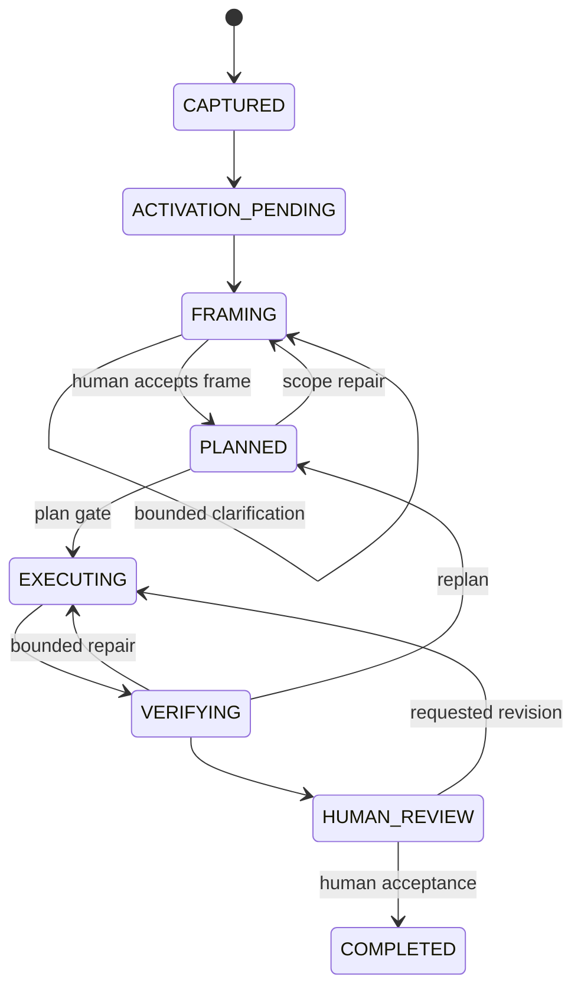

# Domain-neutral lifecycle

## Status

**Current and unchanged through portfolio hardening.** The versioned graph is in
`config/v1alpha1/lifecycle.json`, its closed schema is in
`schemas/v1alpha1/lifecycle-graph.schema.json`, and the pure evaluator is in
`src/kernel.ts`. GitHub event normalization, persistence, and effect execution
are implemented as injected adapter boundaries; live services remain
undeployed.

## States

Side states are `PAUSED`, `BLOCKED`, and `CANCELLED`.

`CAPTURED` is initial-only and has no incoming route. The capability-bearing phase owners are fixed to framing, planning, execution, verification, and human review. `COMPLETED` and `CANCELLED` are permanently terminal; every other conventional state is nonterminal. Lifecycle documents that alter those ownership or terminal invariants fail closed.

| State | Meaning | Authority |
|---|---|---|
| CAPTURED | A GitHub work item exists; no model work is authorized. | Trusted event/API facts |
| ACTIVATION_PENDING | Scope, policy, or budget needs human authorization. | Human approval |
| FRAMING | Evidence and desired outcome are being bounded. | Kernel route plus Activation Lease |
| PLANNED | A reviewed Work Accord and execution plan exist. | Human plan gate |
| EXECUTING | Authorized capabilities are producing proposed artifacts. | Kernel and registry |
| VERIFYING | Deterministic and advisory evidence is being collected. | Verification policy |
| HUMAN_REVIEW | Current-head evidence is ready for independent review. | Eligible human reviewer |
| COMPLETED | Accepted outcome and delivery evidence are recorded. | Human acceptance plus trusted observation |
| PAUSED | Work is intentionally suspended with a recorded resume state. | Authorized human or policy |
| BLOCKED | A dependency, drift, or evidence failure prevents progress. | Deterministic predicate |
| CANCELLED | Work ended without completion. | Authorized human or policy |

## Transition contract

Every transition declaration contains:

- stable route ID and version;
- allowed source and destination;
- authorized actor class;
- exact event class and Trusted Binding;
- expected Work Accord and Phase Contract digests;
- entry predicates and required evidence;
- permitted capabilities and effect classes;
- idempotency key and concurrency scope;
- loop, call, token, cost, and duration limits;
- human gate;
- result and recovery semantics;
- receipt schema.

A model may supply a typed finding or proposal used by a predicate, but it never selects a transition.

## Phase Contracts

Each Phase Contract defines:

- version and compatible lifecycle version;
- entry predicates;
- required evidence;
- allowed capabilities;
- input and output schemas;
- deterministic exit rules;
- bounded loops and escalation paths;
- human gates;
- cost and parallelism ceilings;
- privacy and retention requirements.

Unknown versions fail closed. Domain Packs may narrow a Phase Contract but cannot broaden permissions or weaken gates.

## Depth Profiles

| Profile | Intended rigor | Model work | Gates |
|---|---|---|---|
| D0 Survey | Deterministic intake only | None | Activation if work expands |
| D1 Draft | One bounded proposal | One worker, one revision | Activation and final human review |
| D2 Demonstrate | Default delivery depth | Plan, up to two workers, independent review | Activation, plan, final review |
| D3 Assure | High-risk work | Independent generation/review and replay evidence | Plan, pre-effect, and final gates |

Enterprise policy sets the ceiling. A Domain Pack or Work Accord may only reduce it.

## Authorization expiry and material change

A cost-bearing active state returns to `ACTIVATION_PENDING` when:

- the Activation Lease expires;
- the Work Accord digest changes;
- risk or privacy class increases;
- requested repositories, paths, tools, network, or effects expand;
- the current head/base or relevant policy changes materially.

## Replay and failure

- Reprocessing the same valid event and contract produces the same route and Effect Plan digest.
- A duplicate effect idempotency key is a no-op with a receipt link.
- Stale or unordered input triggers reconstruction from GitHub evidence.
- Partial effects enter `BLOCKED` with a typed recovery route; they do not advance optimistically.
- Retry requires an explicit remaining budget and a retryable error class.
- Bounded loop exhaustion returns to a human gate.

The current kernel emits target-free effect requests only. It cannot call GitHub
or perform a mutation. The separately implemented Single Writer must revalidate
live state before interpreting any effect request.

## Domain neutrality

Engineering, marketing, and business-operations packs define artifacts and review rubrics, not lifecycle authority. All outputs remain repository artifacts delivered through pull requests. External publication, deployment, customer communication, CRM/ERP mutation, payment, and production operations are unsupported.
