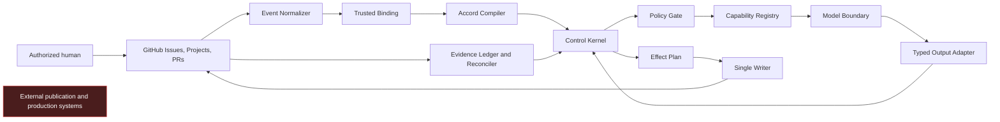

# Hyperfinite architecture

## Status

This architecture is **current through autonomous demo portfolio hardening**.
The pure kernel, offline GitHub adapter, pinned runtime, engineering slice,
bounded Domain Packs, closed audit/metric/budget and packaging contracts,
durable operation-grant store boundary, target-bound installer planner, local
release verifier, four demo packs, deterministic portfolio simulator, and
executable hardening gate are reviewable locally.
Live App installation, durable service deployment, paid inference, publication,
and production mutation remain unavailable.

| Surface | Status |
|---|---|
| Research, provenance, architecture, and threat model | Current |
| Pure Control Kernel, versioned contracts, policy compiler, registry validation, and receipt-chain verification | Current |
| GitHub adapter, capability executor interfaces, and Single Writer | Current; offline-tested |
| Copilot and Agentic Workflow runtime | Current; manual, staged, disabled by default |
| Durable evidence and operation-grant store interfaces | Current; deployment required |
| Governed demo contracts, hybrid selection, runtime registration, simulation, and hardening | Current; repository/hermetic-demo-ready |
| Deployed Evidence Ledger, credential broker, isolated runner, and trust services | Undeployed prerequisite |
| Behavioral evaluation fixtures | Current; live inference remains manual |
| Marketing and Business Operations Domain Packs | Current; hermetic repository-only specialization |
| Installer/migration contracts, compatibility validation, hermetic customer example, and deterministic local release evidence | Current; apply/sign/publish/deploy disabled |
| Autonomous merge, publication, deployment, or production mutation | Unsupported |
| PAT fallback or model-authoritative transitions | Unsupported |

## Purpose

Hyperfinite is a GitHub-native, domain-neutral control plane under the tagline
**“Unbounded capability. Finite control.”** GitHub is the authoritative system
of record. Models may judge and generate; only conventional deterministic code
may authorize, target, transition, or mutate.

The lower-case `agentic-framework` identifiers are the retained technical
compatibility identity, not the product name. Package, API/schema, Capability
Registry publisher, release artifact, evidence marker, and cryptographic domain
values remain in that one fixed epoch. See
[ADR 0019](../adr/0019-hyperfinite-retains-agentic-framework-technical-identity.md)
and the [compatibility matrix](../compatibility.md).

The repository implementation is GitHub Actions and CLI based. It introduces no
deployed daemon, database, queue, webhook service, or cloud broker. Live use
requires separately reviewed trust services; repository validation does not
pretend those services exist.

## Authority invariants

1. Only conventional code selects targets, routes, transitions, Project fields/options, capabilities, retries, idempotency keys, and concurrency scopes.
2. Model output is closed-schema, target-free advisory data. It cannot select an issue, PR, repository, branch, Project item, state, effect, or capability.
3. Model prose is never parsed as a command. Exact activation commands are accepted only from authorized human-authored events.
4. Project mutations are deterministic projections of authoritative state, not authority themselves.
5. Cost-bearing work requires a current human-approved Activation Lease bound to the Work Accord digest.
6. PR effects and review evidence bind to the exact current head SHA.
7. The framework cannot approve or merge its own changes.
8. Unknown schema versions, capabilities, states, identities, or permissions fail closed.
9. Audit and metric output is deterministic, redacted, bounded-cardinality
   evidence and never an authorization input.

## Two-plane model

### Deterministic control plane

- **Event Normalizer** creates an immutable Event Envelope from GitHub event metadata and fresh API reads.
- **Trusted Binding** binds repository, installation, issue, PR, Project item, contract revision, and head SHA without model input.
- **Accord Compiler** loads and validates the Work Accord, Phase Contract, Capability Registry, Domain Pack, Depth Profile, and policy.
- **Control Kernel** evaluates a pure state machine and route table.
- **Policy Gate** verifies actor eligibility, human gates, contract digests, budgets, checks, reviews, Project schema, and current head.
- **Single Writer** performs one final fresh read and executes only an allowlisted Effect Plan.
- **Evidence Ledger and Reconciler** record receipts, detect replay or projection drift, and repair only derivable state.
- **Observability Emitter** serializes hash-chained audit events and derives
  fixed-label metrics without raw identities or secrets.

### Constrained capability plane

- **Capability Registry Executor** invokes only capabilities authorized by the compiled route and policy.
- **Model Boundary** receives bounded evidence and no mutation credential or authoritative target selector.
- **Typed Output Adapters** reject unknown fields, targets, effects, state choices, malformed evidence, and size violations.
- **Domain Packs** specialize artifacts and review criteria without weakening kernel policy.

## Trust zones

| Zone | Contents | Treatment |
|---|---|---|
| T0 | Protected default-branch kernel, policy, and schemas | Trusted only after independent human review |
| T1 | GitHub event metadata and fresh API facts | Trusted source for binding, subject to exact validation |
| T2 | Issue, comment, PR, diff, and repository content | Untrusted data |
| T3 | Model provider, model context, and model output | Untrusted advisory computation |
| T4 | Ephemeral Actions runner | Trusted for one bounded execution; no durable authority |
| T5 | External publishing and production systems | Denied by default |

## GitHub-native durable evidence

- Issues are canonical work identities.
- Work Accord revisions and transition receipts are machine-marked issue comments.
- PRs and commits carry proposed implementation.
- Checks record attempts, exact SHAs, adapter outcomes, and gates.
- Reviews provide human evidence only after identity, authorization, and current-head verification.
- Projects provide a visible materialized projection.
- Sub-issues and dependencies represent bounded decomposition, but the kernel enforces ordering.
- Repository files become durable deliverables only through reviewed PRs.

GitHub supports sub-issues with bounded depth and fan-out, so Domain Packs must flatten or shard larger decompositions rather than assume an unbounded native tree. [Platform evidence](https://github.com/github/docs/blob/be8d08aa6e3a95d7f531c6a00cbeff883e4e9814/content/issues/tracking-your-work-with-issues/using-issues/adding-sub-issues.md#L6-L25)

## Platform assumptions

- The Projects adapter must support current REST and GraphQL surfaces; it must not encode the stale assumption that Projects v2 is GraphQL-only. The pinned GitHub Docs snapshot publishes REST families for drafts, fields, items, projects, and views on GHEC and includes generated `2026-03-10` Projects data. [REST index](https://github.com/github/docs/blob/be8d08aa6e3a95d7f531c6a00cbeff883e4e9814/content/rest/projects/index.md#L24-L33) [Versioned REST data](https://github.com/github/docs/blob/be8d08aa6e3a95d7f531c6a00cbeff883e4e9814/src/rest/data/ghec-2026-03-10/projects.json#L1-L1)
- GitHub Agentic Workflows are Public Preview and subject to change. They remain behind a replaceable adapter and cannot define stable kernel contracts. [Platform evidence](https://github.com/github/docs/blob/be8d08aa6e3a95d7f531c6a00cbeff883e4e9814/data/reusables/copilot/agentic-workflows-preview-note.md#L1-L2)
- Agentic Workflow Markdown is compiled with `github/gh-aw v0.86.2`; lock files pin `github/gh-aw/actions/setup` to commit `48e5fa3ff52294d91d97715017a9f8693a48387f`. The compiler-owned manifest and frontmatter hash are validated for source/lock freshness. [Compiler release](https://github.com/github/gh-aw/releases/tag/v0.86.2)

## Replay, concurrency, and reconciliation

- The effect idempotency key derives from Trusted Binding, event identity, contract revision, route ID, attempt ordinal, and effect type.
- Duplicate delivery reuses the prior receipt and performs no effect.
- Actions serialize by repository ID and work-item node ID with cancellation disabled.
- Parallel workers receive no write token and return only target-free artifacts.
- Fan-in sorts by capability ID, child ordinal, and digest.
- Single Writer rereads the receipt head, contract, Project schema, and PR SHA before mutation.
- Stale work records a discarded-attempt receipt.
- Replay can dry-run and compare regenerated Effect Plan digests.
- A repository effect must atomically claim its signed operation grant in a
  durable cross-process store before mutation; a process-local set is insufficient.

Comments are durable but editable. Receipts therefore form a hash chain; a missing or changed predecessor blocks transitions and enters reconciliation. Whether later releases snapshot receipt chains to a protected branch remains open.

## Project projection

The reusable control-plane schema retains Stage, Depth Profile, Domain Pack,
Gate Status, Contract Revision, Last Receipt, and Attention. The autonomous demo
foundation additionally owns fifteen Project fields: Stage,
Journey Stage, Demo Project Profile, Depth Profile, Gate Status, Contract
Revision, Last Receipt, Attention, Target Repository, Run / Attempt, Current
Draft PR, Current Stage Agent, Stage Interaction, Requested Stage Agent, and
Agent Selection Status. Requested Stage Agent is untrusted input and is excluded
from the fourteen-field projection mapping. A versioned binding manifest records
live field and option IDs. Every projection validates IDs, names, types, and
expected current values. Stage is written last. Human card movement and agent
choice are intent: deterministic policy either issues exact evidence or leaves
the authoritative state unchanged.

Project creation, field creation, schema redesign, and administrator configuration remain human-admin actions.

## Identity and credentials

The deployment adapter uses a GitHub App only. No PAT fallback is supported. A
trusted job mints an installation token immediately before an operation, narrows
repository and permission scope, verifies the installation against Trusted
Binding, executes one effect class, and discards the token. Models never receive
credentials. The repository implements and tests this interface but does not
install the App or deploy the broker.

## Failure model

| Failure | Required behavior |
|---|---|
| Unknown or stale contract/schema | Refuse and request reconciliation |
| Duplicate or reordered event | Reconstruct state and no-op or reconcile |
| Model output invalid or target-bearing | Reject before effect planning |
| Threat result absent, warning, skipped, cancelled, or malformed | Block every write path |
| Reviewer permission stale or unknown | Reject approval evidence |
| PR head changed | Discard result and require fresh verification |
| Partial GitHub mutation | Record typed failure; reconcile from live state |
| Budget or lease expired | Return to activation pending |
| Human/admin prerequisite absent | Block with an explicit runbook action |

## Implementation history and current boundary

The repository delivery sequence is complete through provenance policy, the
Control Kernel, GitHub adapter, Copilot runtime, hermetic engineering slice,
Domain Packs, security and observability, packaging and replication, and the
four-demo governed portfolio with hybrid selection, integration, and hardening.

This completion is repository-scoped. Live Projects, GitHub App installation,
durable service deployment, protected credentials, billing, rulesets, and a
sandbox canary remain human-administrator work. See
[Portfolio activation and readiness](../demos/portfolio/activation-and-readiness.md).
