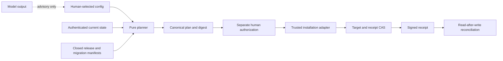

# Packaging and customer replication

## Authority and privilege separation

Packaging preserves the framework authority order:

1. lifecycle graph;
2. Work Accord;
3. policy compiler;
4. Control Kernel;
5. trusted adapter;
6. Single Writer; and
7. model output as untrusted advisory data.

A model never selects an enterprise, organization, repository, installation,
ref, head, migration, operation, path, credential, capability, or effect. The
human-selected `InstallationConfig`, authenticated `InstallationState`, closed
backup evidence, and trusted-signature-verified receipt chain bind those values
before a plan exists. Release-source base/head and customer-target head are
independent bindings; only the latter is the apply CAS head. The canonical plan
is data, not authority. It carries the complete selected configuration, release
manifest, migration manifest, expected pre/post installation states, and
nullable last stable recovery base, each bound to its digest. Apply-side
validation re-runs migration selection and re-derives the exact action list,
four precondition evidence values, and deterministic current-operation evidence
path before authorization verification or adapter access; later trusted
observations must equal the same bound states. Non-recovery operations require
stable input. Recovery alone requires partial input and must retain evidence
from both the partial and last stable states.
The trusted adapter alone validates human authorization, owns App installation
credentials, performs compare-and-swap, and appends a signed receipt.

## Installer state machine

The repository command defaults to `plan`; `offline-validate` repeats the same
checks over caller-supplied files and emits only digests. The ambiguous legacy
`validate` name is rejected. Authenticated live validation is instead the typed
`validateLiveInstallationPlan` boundary: an injected read-only trusted adapter
fresh-observes the exact target, verifies current human authorization twice, and
returns signature-verified evidence bound to the plan, authorization, target,
state, head, adapter, and protected adapter time without applying an effect.
The repository command rejects `apply` and has no command, template, network,
token, or credential input. It is not a packaged CLI. Inputs and outputs must be
bounded regular files beneath the repository with canonical non-traversing
paths.

After raw aggregate container bounds are enforced, every untrusted plan,
authorization, receipt, configuration, state, manifest, and backup input is
canonicalized into one immutable snapshot before semantic validation. Accessors
cannot return one value for checking and another for the adapter.
The planner reads a raw journal length once, requires it to be a primitive
nonnegative safe integer within the closed bound, materializes each bounded
receipt once, proves sequence/predecessor structure over that snapshot, and decides
whether authentication is required only from the same snapshot. Signature,
target, state, and terminal-head checks never rematerialize or reread the caller
container.

A deployment may call `applyInstallationPlan` only through an injected
`TrustedInstallationAdapter`. Apply requires:

- explicit `apply.enabled: true` and one human change identifier;
- an unexpired human-signed authorization over the exact plan, target, source
  head, state, operation, and idempotency key;
- trusted-adapter time for freshness evaluation; callers cannot supply a clock;
- adapter verification using credentials unavailable to the model job;
- a fresh observed-state digest equal to the plan CAS precondition;
- a second protected-clock read immediately before the apply call;
- an exact trusted precomputed result head for any repository-file effect;
- one effect attempt with no blind retry; and
- a signed receipt plus exact read-after-write result-state match and an
  authoritative post-apply receipt-store reread.

The final caller-side clock read narrows the awaited-check window but is not an
atomicity claim. The trusted adapter contract requires its effect implementation
to atomically enforce current authorization, expected state, expected head, and
idempotency with the mutation.

The configuration, plan, idempotency key, authorization, and adapter input bind
the exact migration-manifest digest. The plan also carries each selected
directional step checksum and four enforced precondition evidence digests: exact
backup, source version, target head, and receipt chain. The terminal receipt must
bind the observed state. Irreversible migrations and package-file removals each
require a separate explicit authorization bit in addition to the signed plan.
The idempotency key covers the complete action list, expected result head/state,
and retained evidence paths, so effect-distinct plans cannot collide.
Planner and apply-side validation also reject equality or segment-boundary
ancestor/descendant overlap between an action and retained evidence; a plan
cannot overwrite, replace, or remove evidence while its result state claims that
evidence remains retained.

An existing exact receipt makes repeated safe applications converge without a
new effect even after the original authorization expires; no mutation remains
to authorize. Fresh authorization is required whenever no persisted receipt
exists. A receipt/state disagreement or lost acknowledgement enters recovery
and never becomes a success-shaped fallback.

`validateInstallationJournalStructure` proves only bounded shape, sequence, and
predecessor linkage. It is intentionally named as structural and does not imply
authentication. Non-empty receipt journals require
`validateAuthenticatedInstallationJournal` with a trusted verifier. Every receipt signature,
stable target identity, predecessor digest, sequence, and expected-to-result
state transition is validated twice over immutable snapshots before the planner
emits `receipt-chain-valid`. The terminal result must equal the observed state.
Its applied head must also equal the observed target head.

The raw receipt array is capped at `MAX_INSTALLATION_RECEIPTS` (512) before
spread, map, clone, canonicalization, or element access in the planner,
authenticated validator, and installer reader. The repository does not
implement compaction or checkpoints. At capacity it fails closed: operators
must first archive the complete chain externally and deploy an independently
reviewed authenticated checkpoint protocol that preserves predecessor and
terminal bindings. Truncation, sequence reset, or genesis reuse is prohibited.

## Migration, rollback, recovery, and uninstall

`config/v1alpha1/migrations.json` is one contiguous compatibility graph ending
at `currentVersion`. Each edge has unique source and target versions,
has exact versions, a checksum, four named preconditions, an irreversible flag,
rollback declaration, and `preserve` evidence retention. Only contiguous graph
edges are valid. Downgrade traverses explicit reversible edges in reverse.

Installation receipts are signature-, target-, state-, sequence-, and predecessor-bound. Gaps, duplicates,
reordering, replay, a wrong head, a partial state, or an ambiguous state blocks
normal operations. `recover` is the only operation admitted from a partial
state. Journaled recovery separately binds the authenticated current partial
state and the last completed stable state. Migration source/irreversibility
comes from that stable state; evidence paths from both states are retained before
exact package-file reconciliation.
Uninstall plans removals only for
files whose full inventory equals the selected installed-version manifest and
retains backup and
receipt paths. It never recursively deletes a repository or customer content.
Recovery rereads the exact persisted receipt by idempotency key; caller-supplied
receipt bytes alone cannot prove persistence.

## Release artifact ownership

| Artifact | Owner | Authority |
|---|---|---|
| Packaging schema, compatibility and migration manifests | Reviewed repository | Contract/configuration only |
| Installation plan | Deterministic planner | Non-mutating proposal |
| Human authorization | Independent authorized human and trusted signer | Apply gate only |
| Installation receipt | Trusted adapter/evidence service | Evidence of one bound operation |
| Source archive, manifest, SBOM, provenance, unsigned statement | Local release tool | Reproducible local evidence only |
| Release-candidate checklist | Local release tool plus exact-head evidence providers | Always `no-go` until humans decide outside automation |
| Production signature/publication | Future approved release service and humans | Not implemented |

The release tool reads blobs from the exact Git object database rather than the
working tree. It accepts only regular files with modes `100644` or `100755`, caps
file count, file size, and archive size, and uses zero owner/timestamp ustar
headers. The JSON Schema's registered `release-path` format delegates to the
authoritative `assertReleasePath` semantic validator, including NFC, denied
control/line-separator/segment checks, and a canonical UTF-8 slash-boundary ustar
split with a name of at most 100 bytes and prefix of at most 155 bytes. Central
document validation, planning, archive writing, and verification all share that
implementation.
SPDX output includes required
copyright fields and non-empty SHA-1/SHA-512 checksums when lock integrity is
available; license declarations must parse as SPDX expressions or use
`NONE`/`NOASSERTION`. All Git reads disable replacement objects. Verification
re-derives the exact package version, commit time, license/notices baseline,
tree, SBOM, provenance, attestation, and no-go checklist.
Release and customer-starter manifests derive both their canonical lowercase
`server` and `owner/repository` from a `github.com` or data-residency
`*.ghe.com` origin URL. Verification compares both fields, preventing
same-name repositories on different GitHub hosts from colliding. A malformed,
credential-bearing, or other-host origin is refused instead of falling back to
a fixed source name.
Build output must be outside the source repository so creating evidence cannot
dirty the source that verification rechecks.

## Customer-starter and open-source-preflight tooling

`src/customer-starter.ts` (ADR 0015) reuses the same Git-tree/path/hash/
output-safety primitives — split across `src/release-support.ts` (shared,
not re-exported from `src/index.ts`) and `src/release.ts` — to build a
configurable, default-deny subset of the exact reviewed tree instead of the
full release archive. The shared output/verify path-safety helpers
(`safeOutputPath`, `assertSafeOutputRoot`, `canonicalDirectory`,
`writeExclusive`) require a private, non-symlink, owner-exclusive-write
directory for both a build's output parent and a directory being read back
(a verify `bundleRoot` or the source `repositoryRoot`), re-validating
identity after every `realpathSync` resolution or directory creation to
close the check-then-use (TOCTOU) window a shared writable parent (e.g.
world-writable `/tmp`) would otherwise leave open; this applies to both
`release.ts` and `customer-starter.ts` identically. The shared `listGitTree`
also rejects any two tree
paths that collide once extracted onto a case-insensitive or
Unicode-normalizing filesystem (NFC + case-fold), protecting both the full
release archive and every customer-starter profile. A
`CustomerStarterSelection` names included/excluded release-path prefixes
bound to an exact `sourceHeadSha` and a `resolvedClosureDigest` — a digest
over the selection's own resolved file set at that exact commit,
independently recomputed at both the reviewed commit and the current build
head, so ancestry of `sourceHeadSha` alone is never sufficient evidence
that nothing matching the selection changed since review. An extension
profile (for example `demo-portfolio`) additionally binds
`extendsProfileId` and a `baseSelectionDigest` to an exact base, so its
manifest is provably the deterministic union of the base's files plus its
own, never a hand-assembled or overlapping second selection; a closed,
trusted profile catalog (`src/customer-starter-catalog.ts`) is the only
place a profileId's exact selection-document path, `extendsProfileId`,
advertised scripts, and the two shared scan-denylist paths may be
declared. `buildCustomerStarterBundle`/`verifyCustomerStarterBundle`
accept only a `profileId` — no parameter accepts a selection object, a
base manifest, the catalog itself, a denylist, or an advertised-script
list; `src/customer-starter.ts` resolves its own module-private,
recursively-frozen catalog reference (constructed independently from, and
sharing no object graph with, `src/customer-starter-catalog.ts`'s own
exported, frozen, detached inspection copy used only by read-only tooling)
and is never exported, so no deep import of the compiled package can reach
it or supply an alternate one. Every selection's exact bytes are resolved
and read from the reviewed Git tree, and a base profile's manifest is
derived entirely internally rather than trusting a caller-supplied one.
Building resolves the selection against a cheap tree listing before
fetching any content, so a starter subset is not bounded by the full
release archive's file-count cap.

Before any output file is written, the build runs deterministic secret,
internal-reference, and customer-data scans (driven by reviewed denylist
configuration, never model output) plus five completeness closures —
module imports (TypeScript, `.mjs`/`.cjs`/`.js`; static/dynamic `import`,
re-export, and `require`, resolved over a comment- and string-literal-
aware source redaction rather than a bare regex), JSON Schema `$ref`,
generated workflow lock/Markdown-source pairing, Markdown links (walking
`markdown-it`'s own token tree, so reference-style links/images resolve
correctly), and each profile's own declared `package.json` scripts — and
throws on the first violation rather than shipping a "flagged" bundle. The
resulting `CustomerStarterPreflightReport` is always `decision: "no-go"`,
`authoritative: false`, `selfApproved: false`, and binds the live
`OpenSourceReadinessAssessment` by exact digest.
`npm run starter:local -- build|verify --profile <id>` is the only
customer-starter command surface; it cannot apply, publish, install, or reach
the network and is not a packaged CLI.
`npm run validate:customer-starter-extraction` is a separate, network-
reaching, checked (not hermetic-unit-test) validation that builds each
profile, extracts it with no Git history, runs `npm ci`, and runs every
advertised script, retaining a JSON evidence record. See
[ADR 0015](../adr/0015-customer-starter-and-open-source-preflight-tooling.md)
and the [customer-starter example](../../examples/customer-starter/README.md).
