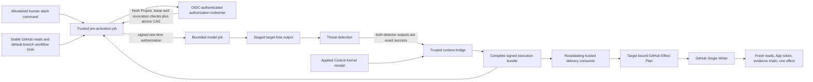

# Copilot runtime architecture

## Status

The runtime is a **governed control surface**. It provides reviewable Agentic
Workflow sources, compiler-generated locks, custom phase agents and skills,
closed policy/state/authorization contracts, deterministic pre-activation
redemption, and a bridge to the existing GitHub Effect Plan boundary. It is
disabled by default, uses default-branch slash commands only, and stages all
platform safe outputs.

This repository does not install a GitHub App, configure a Project, enable
Copilot billing, deploy the bridge, or perform a live write. GitHub Agentic
Workflows are Public Preview and remain behind this replaceable adapter.

## Trust boundary

The model is not an authority. It cannot choose a repository, work item,
Project item, route, transition, capability, credential, or effect. Targets
come from fresh Trusted Binding data, and effects come from a Control Kernel
route. Framing and review model jobs receive a least-privilege `GITHUB_TOKEN` for
declared read tools plus `copilot-requests: write`. Execution has no GitHub
tools and receives only logical target slots. No model job receives GitHub App
credentials, an OIDC token, a PAT, a mutation tool, or writable credentials.

## Pre-activation

Each source workflow defines an `on.steps` job that completes before model
execution. `scripts/runtime-pre-activation.ts` fails closed unless all of the
following are true:

1. activation is explicitly enabled, the slash command is executing the
   configured workflow from the repository's current default-branch SHA, and
   no arbitrary dispatch ref is accepted;
2. the actor is an allowlisted, non-bot user whose current repository role is
   one of the exact compiler-enforced roles `admin`, `maintainer`, or `write`;
   the REST guard independently requires legacy `permission` `admin` or `write`
   (`maintain` maps to legacy `write`);
3. repository and work-item numeric/node identities are fresh;
4. the work item is present in the configured Project and its Project item is
   fresh;
5. the newest matching runtime-state marker was authored through the exact
   configured GitHub App and bot identities, was never edited, and has a valid
   Ed25519 signature from the configured key ID;
6. state, phase, role, capability, Work Accord, runtime policy, Control Kernel
   enterprise-policy digest, Activation Lease, contract revision, and kernel
   receipt agree;
7. the pull-request head is current for review activation;
8. state and revocation observations are no more than five minutes old, are not
   future dated, and remain before the trusted current time and lease expiry;
9. the state carries a signed one-time nonce and enough remaining AI credits for
   the full 500-credit per-invocation reservation;
10. repair and recursion limits are not exhausted; and
11. an OIDC-authenticated trusted redeemer freshly rechecks Project membership,
    state and lease revocation, then atomically consumes the nonce and exact
    `(workflow, run_id, run_attempt)` tuple, reserves the full cost, appends a
    signed CAS ledger record, and returns the signed authorization together
    with the actual authenticated applied Kernel result.

The closed `CopilotRuntimeState@2.0.0` and
`CopilotRuntimeAuthorization@2.0.0` schemas
reject unknown properties. Execution state additionally carries a signed,
canonical Work Accord and exact execution grant plus the typed planning
artifact. Only the target-free planning artifact, logical slots, fixed
verification IDs, and their digests enter model context; exact paths stay in
the sealed authorization transferred directly from pre-activation to the
post-agent bridge. State is
not trusted because it appears in a comment: its canonical payload must verify
cryptographically, and GitHub App attribution plus current API state must also
agree. The guard resolves the final GitHub comment page and fails closed if
the first or last page, ETag, selected comment identity/update time, head, or
page count changes during repeated reads. The redeemer repeats these checks
under its isolated GitHub App Projects-read authority before committing the CAS.
Missing redeemer configuration, OIDC, verifier key, service availability, or
CAS success keeps the runtime inactive.

Runtime state and authorization retain two closed binding domains. The existing
`bindingDigest` is the canonical digest of the complete validated
`TrustedGitHubBinding`. `kernelBindingDigest` is the canonical
`workAccordBindingDigest()` produced from repository numeric ID, exact
work-item node ID, and immutable Work Accord source digest. The signed
`workAccordSourceDigest` lets each runtime authorization boundary recompute
that identity. State signatures,
authorization signatures and digests, candidate digests, redemption keys, and
ledger heads use distinct domain-separated payloads and include both values.
The bridge recomputes `bindingDigest` from its fresh binding and verifies
`kernelBindingDigest` against the actual applied Kernel snapshot and receipt.
Old, missing, substituted, or swapped values fail before an effect plan.

### Runtime wire compatibility

The dual binding fields and v2 signature, authorization-digest, candidate,
redemption-key, and ledger-head domains are a wire-incompatible change from the
legacy `1.0.0` records. Both closed documents therefore identify themselves
as `schemaVersion: "2.0.0"`. `planCopilotRuntimeWireMigration()` returns
`SIGNED_EVIDENCE_REISSUE_REQUIRED` for `1.0.0`; there is deliberately no
document migration because changing a signed one-time record would invalidate
its signature and could revive a nonce or reservation. Trusted services revoke
or expire the old evidence and reconstruct fresh `2.0.0` state and
authorization from current authenticated inputs. Unknown versions fail closed.

## Phase bindings

`config/v1alpha1/copilot-runtime-policy.json` is the canonical binding table.
Agents are subordinate to the Control Kernel and are not independently
user-invocable.
Each binding also carries a trusted workflow class and exact slash-command
metadata. Validators select class-specific controls from this binding, never
from a workflow filename or self-declared workflow value. Portfolio stages
register complete per-demo capability and runtime-binding shards; the generic
`runtime-*` agents remain templates and cannot satisfy a reserved stage
identity.

| Phase | Role | Agent | Capability | Tools |
|---|---|---|---|---|
| Framing | framer | `runtime-framer` | `core.frame-artifact@1.0.0` | `github/issue_read`, `safeoutputs/add_comment` |
| Execution | executor | `runtime-executor` | `core.execute-bounded-change@1.0.0` | no GitHub/MCP/network/secret tools; logical slot output only |
| Verification | reviewer | `runtime-reviewer` | `core.review-current-head@1.0.0` | read, search, three exact GitHub PR/repository reads, `safeoutputs/submit_pull_request_review` |

Every agent file has an explicit allowlist. An omitted list is never
interpreted as unrestricted access. Skills also declare exact tools and
immutable Capability Registry references. Repository and path instructions
reinforce authority refusal, target-free output, protected-file blocking, and
current-head review. `authority-refusal` is a separately bound cross-phase
safety skill; it never stands in for the phase capability.

The disabled-by-default `agentic-execution` source exposes no
GitHub model tool or direct GitHub mutation output. Its one custom staged output
accepts a closed `TargetFreePatch@1.0.0` envelope bound to the signed planning
artifact and execution grant. The sealed full authorization moves through a
run/attempt-specific artifact that the model cannot read through any configured
tool. A credential-free post-agent job verifies the redeemer signature and
digests, invokes the same bounded worktree executor used by the hermetic slice,
and persists one signed execution bundle containing the authorization,
actual applied Kernel result, current policy digests, exact-success threat
evidence, and complete signed patch content plus base/tree/patch, plan,
grant, model-output, threat-evidence, and Kernel-proof digests. A separate
trusted consumer round-trips and revalidates that bundle before invoking the separately
deployed Control Kernel/GitHub adapter. The executor maps slots to exact paths,
intersects them with the Work Accord, and subtracts `.github/**`, `config/**`, `schemas/**`,
`scripts/**`, `src/**`, `tests/**`, dependency manifests and locks, `.npmrc`,
`.env*`, `.gitattributes`, every CODEOWNERS location, workflow-consumed build
configuration, `tsconfig.json`, and `LICENSE`. It rejects Git pathspec magic,
sets `GIT_LITERAL_PATHSPECS=1`, and initializes an isolated Git
repository with system/global/local configuration, hooks, templates, aliases,
credential helpers, fsmonitor, external diff, prompts, and replacement refs
disabled. It validates the pre/post Git diff, requires the staged/indexed set to
equal the authorized literal targets, rejects empty diffs, and runs only
fixed verification command IDs. No default `create_issue` handler remains in
the generated lock. Live delivery remains inactive until administrators deploy
the operation-scoped App adapter, signer, evidence store, and serialized writer.

## Output and threat boundary

The workflows declare outputs explicitly so `gh-aw` cannot auto-enable its
default issue-creation output. Framing permits one staged issue comment.
Review permits one staged `COMMENT` review and cannot approve, request changes
as an authority action, dismiss, merge, or push. Mentions are disabled and
GitHub references are empty. `max-bot-mentions` is set to the compiler's
minimum accepted value of one but has no effect while `mentions: false`.

Platform threat detection runs after the agent. A detected threat or detector
failure blocks the platform handler, but a warning is not sufficient
authorization for this framework. `bridgeRuntimeOutput()` separately requires:

- a valid Ed25519 authorization signature from the configured redeemer key;
- an authorization bound to the exact workflow ref/SHA, run ID/attempt, event,
  actor, nonce, redemption key, cost reservation, route, receipt, lease, policy,
  state, binding, head, capability, output schema, and expiry;
- an applied Control Kernel result supplied to the bridge itself, with a
  recomputed receipt/effect digest, matching route, capability, binding, head,
  Work Accord, snapshot, processed-event entry, receipt head, and internally
  consistent Kernel policy;
- a fresh Trusted Binding whose full digest matches activation state;
- a distinct Kernel binding digest that matches the actual applied Kernel
  snapshot and destination receipt;
- threat status exactly `success`;
- the exact signed redemption and authorization digests carried by the model
  job, plus exact input and output digest equality;
- fresh threat evidence and an unexpired authorization; and
- a closed, target-free `GitHubSafeOutput` for framing/review, or a
  `TargetFreePatch@1.0.0` envelope for execution.

Only then does the bridge call `translateSafeOutput()` with an externally
selected comment intent and fresh Trusted Binding. The returned Effect Plan is
still not a write; the existing Single Writer must validate and execute it.
`bridgeRuntimeOutput()` invokes `bindKernelAuthorization()` itself and verifies
both the signed runtime-policy digest and the signed Control Kernel
enterprise-policy digest against the applied snapshot and destination receipt.
Snapshot lifecycle, registry, Domain Pack, Phase Contract, compiled-policy, and
enterprise-policy digests must also match the receipt. Signed authorization
without the exact applied Kernel result, or with a
refused/noop/wrong-route/wrong-capability/stale-policy result, fails closed. A
caller cannot manufacture authority by recomputing an unkeyed digest, replay a
nonce or run attempt, or substitute a route/head/output. Do not remove
`staged: true` or wire a platform safe-output handler directly to
production while this boundary is required.

All three workflows explicitly disable gh-aw's implicit `missing-tool`,
`missing-data`, `report-incomplete`, `noop`, failed-job, and agent-failure issue
paths. Generated conclusion jobs therefore have no `issues: write`; only the
declared staged preview tool remains available to the model.

The review agent preserves the trusted workflow checkout at the workspace root
and never checks out or executes pull-request content. Immediately before
inference trusted workflow code compares the exact live base and authorized head,
bounds the patch metadata/content, rechecks both live identities, and writes one
`review-target/evidence.json`. It restores the trusted reviewer profile at the
actual workspace discovery root together with only the two required trusted
skills and exact evidence after deleting every other workspace entry. The final
tree is exactly one reviewer profile, two skills, and
`review-target/evidence.json`; it contains no repository source, unrelated file,
credential, or `.git` metadata. Source explicitly disables bash, edit, and CLI
proxy, enables bare mode, and adds write/shell deny flags; generated output must
contain no all-tools/all-paths flag and must have exactly two add-dir roots. The
reviewer profile's exact tool list omits write and shell; deny flags are defense
in depth rather than the source of tool availability. Both review and
threat-detection engine versions are exactly `1.0.79`; both generated installers
receive that literal version and no `GH_AW_COMPILED_VERSION`, so live
compatibility data cannot select another CLI. Both generated executions include
`--no-auto-update`; the probe invokes the same flag and accepts only an effective
`GitHub Copilot CLI 1.0.79` version result under the isolated runtime home, so a
cached newer application cannot supersede the launcher. The second root is the
unavoidable pinned gh-aw control surface containing pinned action, harness, and tool
scripts/binaries, the rendered prompt, model/firewall metadata, safe-output/MCP
configuration, and bounded logs/usage. Duplicate
activation profile/skills, `base`, and prompt source/import metadata are removed;
validation pins the exact seven post-guard setup steps that may construct the
remaining surface. The model receives
local read/search over those declared trusted scopes only and cannot select a
repository, pull request, ref, or GitHub API argument. The prompt and bridge
remain bound to the same SHA. The runtime probe verifies the exact official CLI
release archive and extracted executable plus a deterministic manifest digest
over every file and directory in gh-aw v0.86.2's complete setup JS tree; sibling
mutation, symlink, missing path, or extra path fails before any CLI execution.
The probe also derives its security-sensitive flags from one constant sequence
and requires the generated command to contain that sequence. Probe children
receive only a fixed environment allowlist plus isolated home/config/temp roots;
Node module hooks, dynamic-loader hooks, and unrelated parent variables are not
forwarded. After the deterministic agent/evidence startup control, a separate
live challenge keeps a random mode-`000` sentinel present outside both add-dir
roots, asks for its exact content, and requests a harmless shell marker inside
the test workspace. The verifier rejects the secret in process output or any
workspace/control log and rejects a marker on disk. Post-launch success also
requires the same path and open descriptor device/inode, regular-file type,
mode, size, and original content digest. The descriptor permits safe zeroing of
the original inode even after path replacement; cleanup removes the exact
replacement without following symlinks and never hides an earlier launch error.
This does not treat a model refusal or boolean as proof
that either tool call occurred, and it does not claim `--add-dir` is a general
read sandbox. The separate read proof requires the reviewer to echo a random
160-bit evidence `headSha` that is absent from prompt, environment, and
arguments; schema version text is not accepted as evidence of a read.

## Fixed limits

| Limit | Value |
|---|---:|
| Workflow timeout | 10 minutes |
| Model turns | 8 |
| Continuations | 1 |
| Main run AI credits | 200 |
| Daily AI credits | 1500 |
| Threat-detection AI credits | 100 |
| Cascade runs | 0 |
| Full pre-inference reservation | 500 AI credits |
| Concurrent runs per repository/work item | 1 |
| Recursion depth | 0 |
| Repair loops | 2 |
| Patch bytes | 262144 |
| Evidence age | 300000 ms |

Cancellation is disabled and queueing is preserved. The 500-credit reservation
is `(200 main × (1 + 1 continuation) + 100 threat detection) ×
(1 + 0 cascades)` per invocation. The 1500-credit daily ceiling permits one
full framing, execution, and review invocation without deadlocking the slice.
Slash commands can bypass platform daily-budget guardrails, so trusted atomic
reservation, cumulative provider-usage settlement, crash recovery, and signed
release of unused reservation remain mandatory.

## Toolchain and source ownership

Agentic Workflow Markdown under `.github/workflows/*.md` is the source of
truth. `github/gh-aw v0.86.2` compiles it to `.lock.yml`; the reviewed setup
action commit is
`48e5fa3ff52294d91d97715017a9f8693a48387f`. The compiler also owns
`.github/aw/actions-lock.json`. Never edit generated locks by hand.

`npm run validate:gh-aw` is the fail-closed validation entry point. In v0.86.2,
`gh aw validate --strict --no-check-update` rewrites `actions-lock.json` using
the default action-mode repository even though validation does not emit
workflow locks. The repository command snapshots every generated artifact,
runs strict validation, recompiles with
`gh aw compile --gh-aw-ref v0.86.2 --strict --validate --approve
--no-check-update`, runs `npm run validate:workflows`, and then requires the
generated bytes and Git working tree to be unchanged. Do not leave the strict
validation command as the final gh-aw operation.

`npm run validate:workflows` checks the pinned compiler, source frontmatter
hash, generated bytes, exact action-lock set, action pin, guard ordering,
authorized-head checkout, staged outputs, absence of implicit fallback tools
and conclusion issue authority, and absence of operational PAT fallback.
Compiler-owned OAuth-token checks, lockdown
checks, and redaction steps mention conventional `GH_AW_GITHUB_*` secret names
even when they are unset; the operational MCP and safe-output credentials are
explicitly bound to `GITHUB_TOKEN`.

The GitHub read gateway is the only first-party MCP surface and its exact
toolsets/tools are recorded per phase in both runtime policy and Capability
Registry metadata. `mcpEnabled: false` and empty MCP server/tool lists in the
runtime access policy refer to external MCP, which remains disabled.

Official references:

- [Agentic Workflow source and lock structure](https://github.github.com/gh-aw/reference/workflow-structure/)
- [Safe outputs and staged mode](https://github.github.com/gh-aw/reference/safe-outputs/)
- [Threat detection](https://github.github.com/gh-aw/reference/threat-detection/)
- [`gh-aw v0.86.2`](https://github.com/github/gh-aw/releases/tag/v0.86.2)
- [Least-privilege `GITHUB_TOKEN` permissions](https://docs.github.com/en/actions/tutorials/authenticate-with-github_token)
